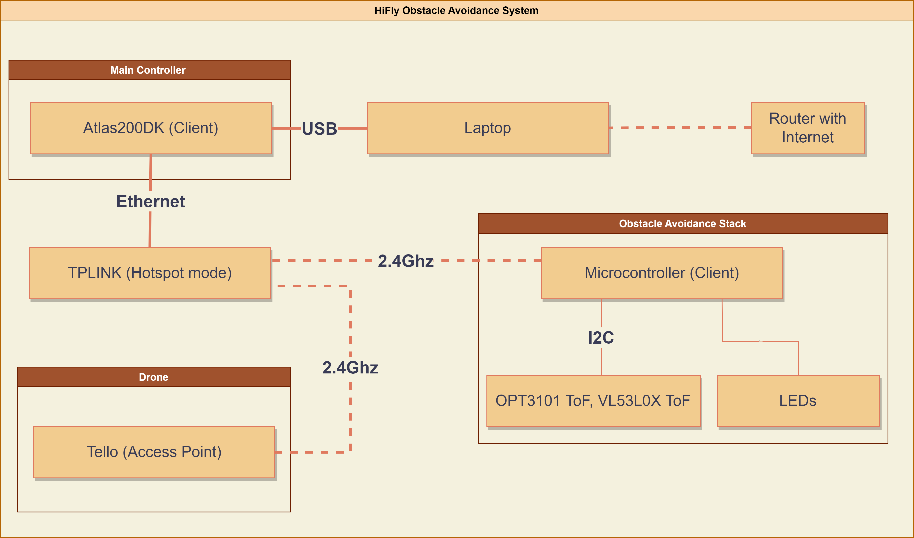
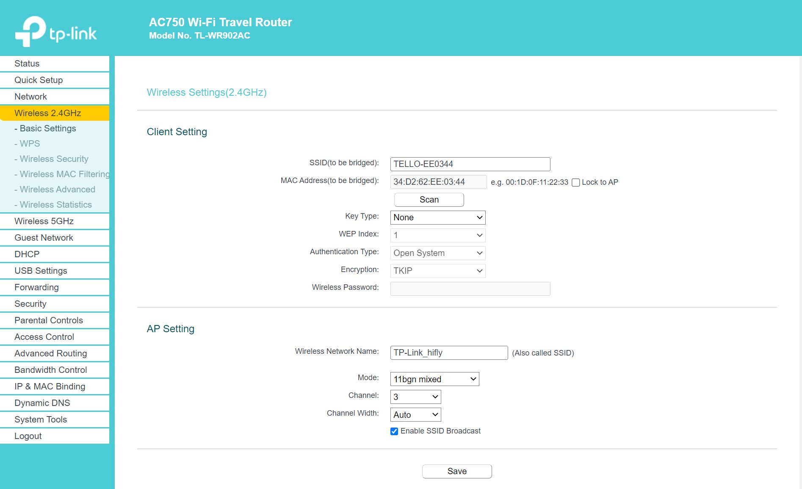
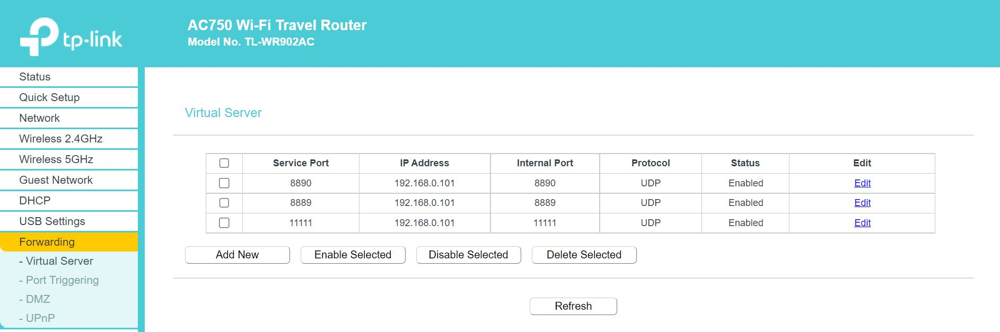

# HiFly Obstacle Avoidance System
This is a setup guide to connect Tello Drone, Atlas200DK devkit board, Obstacle Avoidance Stack components together through WiFi communication.

## Prerequisites
- Atlas200DK HiFly project setup finished 
- Obstacle Avoidance Stack setup finished

## Setup files and networking
The Arduino in the Obs Avoidance stack sends data to a specific IP and port defined in its code. This has to be the IP of the Atlas200DK and the port defined in the tello.py. The 200DK and Arduino are on the same subnet as the TPLINK router, so communication between them is straightforward.

The Tello is on a different network, so port forwarding must be defined to allow the Atlas200DK to receive data from the Tello.

### Steps
- Move 4 files to the Atlas200DK - 01-netcfg.yaml, ObsAvoid.py, simple_takeoff.py, tello.py
- Setup TPLINK router: Connect 2.4Ghz to Tello, setup port forwarding

- Change the netcfg.yaml under /etc/netplan/*.yaml to the new 01-netcfg.yaml

- From the Atlas200DK, try the following ping tests. If all works, networking setup is successful!: 
    - ping 192.168.0.1      # Router
    - ping 192.168.0.102    # Arduino
    - ping 192.168.1.0      # Tello

- Change the pip installed tello.py to the new tello.py. The installed one can be found by the python code: from djitellopy import Tello, print(tello.__file__)

## Running example
The intended core functionality of this project is access to Obstacle Avoidance sensor readings from the Atlas200DK through the modified tello.py class. A simple algorithm to process these sensor readings and return velocities which can be used to avoid the sensed obstacles is also provided, but only for basic demonstration purposes.

The simple_takeoff.py script uses the calculate_drone_velocity from ObsAvoid.py to implement the above mentioned basic algorithm. Set the LIVE_FLAG inside the script to either only print the sensor readings and computed velocities, or actually send them to the Tello drone.
- python3 simple_takeoff.py

